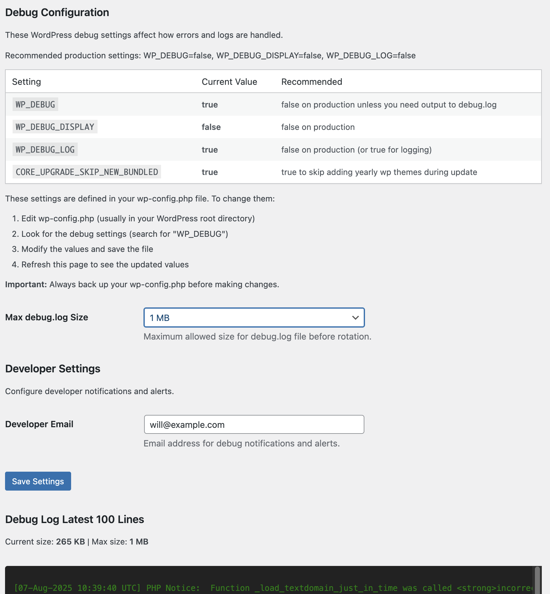

# Chainsaw

A simple plugin for managing your Wordpres debug.log  

# Chainsaw Cache Busting Plugin

## Description

Chainsaw is a simple WordPress plugin to help you avoid the server filling up with logs, keep track of recent errors and debug your wordpress site.

## Installation

1. [Download the latest ZIP from GitHub](https://github.com/kindlemanhq/chainsaw).
2. In your WordPress admin, go to **Plugins > Add New**.
3. Click **Upload Plugin** and select the ZIP file.
4. Install and activate the plugin.

## Usage

1. Go to **Settings > Chainsaw** in your WordPress admin.
2. View and clear available caches with one click.
3. (Optional) Enter your Sucuri API key to enable Sucuri WAF cache busting.

[https://kindlemanhq.github.io/chainsaw/](https://kindlemanhq.github.io/chainsaw/)

## Credits
This is built by the good Kindlefolk. You can [contact us for help, support, coffee or a whole new site.](https://www.kindleman.com.au/contact/).